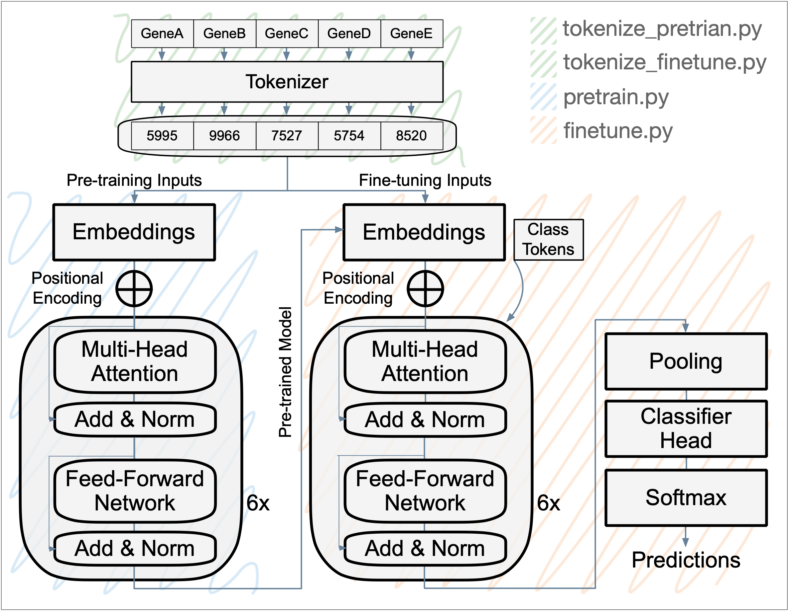

**PCformer**
============
`Transformer model for the annotation of prostate cell types from ranked-value single-cell and single-nucleus RNA, ATAC, Xenium, and Visium data.` 

Prostate cancer (PCa) shows strong heterogeneity in gene expression, making tumor cell annotation difficult. Current single-cell annotation methods rely on non-standardized approaches, often leading to inconsistent results. To address this, we developed a deep learning transformer model that standardizes the annotation of PCa cells. The architecture builds on a single-cell RNA foundation model trained on 560,492 cells and 13,745 genes from the PCa Atlas. This foundation model learns cell type specific gene expression patterns, which are then fine-tuned for the classification of prostate cell in new data.

**DATASETS**
------------

**> Prostate single-cell RNA-seq matrix**

Format

|        | GeneA | GeneB | GeneC | GeneD | GeneE |
|--------|-------|-------|-------|-------|-------|
| Cell_1 | float | float | float | float | float |
| Cell_2 | float | float | float | float | float |
| Cell_3 | float | float | float | float | float |

**> Metadata**
|         |           |      | Cell Type Classes |          |           |
|---------|-----------|--------|---------------|------------|-----------|
| Basal   | Bcell     | Club   | Endothelial   | Fibroblast | Mast_cell | 
| Myeloid | Non_Tumor | Plasma | Smooth_Muscle | Tcell      | Tumor     |
|  |  |  |  |  |  |  

Format

| CellName | ID |
|----------|-------|
| Cell_1   | Tcell |
| Cell_2   | Club  |
| Cell_3   | Tumor |
| Cell_4   | Basal |
| Cell_5   | Tumor |


**HOW TO RUN PCFormer**
-----------------------

### Installation

```bash
git clone https://github.com/franklinhuanglab/PCformer.git
cd PCformer
pip install -r requirements.txt
```

### Input file requirements
- Gene expression matrix
- Metadata file (barcodes and annotations)
- Gene vocabulary file

Note: Metadata barcodes must match matrix row names


### Directory

```
.
├── bin/
│   ├── run_tokenize_pretrain.sh   -> Tokenize data for foundation model training
│   ├── run_pretrain.sh            -> Train the foundation model
│   ├── run_tokenize_finetune.sh   -> Tokenize data for classification tasks
│   ├── run_finetune.sh            -> Fine-tune the classifier
│   └── run_inf.sh                 -> Run inference on hold-out or new datasets
```

### Script execution order

```bash
bash run_tokenize_pretrain.sh
bash run_pretrain.sh
bash run_tokenize_finetune.sh
bash run_finetune.sh
bash run_inf.sh
```

### Script configuration

Create a copy of the relevant script and use a descriptive suffix for the current project (e.g., `run_finetune_Atlas.sh`, `run_inf_Atlas.sh`).

For each script, modify the variables in the `USER MODIFIED VARIABLES` section:

```bash
CPUS=N                                 -> If planning to use GPU, CPU can be set to a low value
MODALITY="scRNA"                       -> `data` subdirectory where the input data lives
MATRIX_FILE="Atlas_matrix.csv.gz"      -> Gene expression matrix; main input file
MODEL_NAME="Atlas"                     -> Model name that the user chose during training             
METADATA="Atlas_metadata.csv"          -> Metadata used for training using labels; [ barcode    ID ]
GENES="gene_names_atlas.txt"           -> Vocabulary gene names for the tokenizer
STAGE="<pretrain|finetune|inference>"  -> Which step of the pipeline is being run
EMBED_DIM=1024                         -> Embedding size (1024 dimensions). Other options: 512, 2048
```

Additional variables depending on the stage:

```bash
LABELS="${INPUT_DIR}/${METADATA}"     -> The set of training labels from the metadata
TRUE_LABELS="${LABELS}"               -> if running on hold-out dataset, use "${LABELS}" 
                                         if using new dataset, specify the metadata directory
                                         if labels unavailable, use "NULL"
BARCODES="${CACHE_DIR}.../holdout_barcodes.txt" 
                                      -> if hold-out dataset, use cache holdout_barcodes.txt dir
                                         else, use "NULL" 
MODEL_PT="<pretrained PT model>"
```

The hold-out dataset is created during `tokenize_pretrain.py`, excluded during fine-tuning, and can later be used for model evaluation and inference.


**WORKFLOW**
------------




**Pre-processing the Corpus Data for Pre-training**
---------------------------------------------------

Script: `tokenize_pretrain.py`

The initial step involves splitting the data into two sets: 1) A training set composed of 80% of the cells in the dataset to train the model, 2) a validation set composed of 10% of the cells used to evaluate the model's performance during training, and 3) a hold-out dataset composed of 10% of the cells used for inference.

Each set is individually passed to a tokenizer that first removes gene expressions with zero value and then ranks the genes by importance. The gene names are then tokenized into unique numeric IDs.

Input:
 - **< DATA_MATRIX >** (_csv_): Contains the cell gene expression matrix. The script supports file formats [.csv, .csv.gz] and delimiters [comma, tab].  
    _Example: data/scRNA/Atlas_matrix.csv.gz_
 - **< GENE_NAMES_FILE >** (_list_): List of gene names included in the expression matrix; the vocabulary.  
    _Example: data/scRNA/gene_names_atlas.txt_
 - **< CACHE_PREFIX >**  (_str_): Directory prefix for caching tokenized input data.  
    _Example: cache/pretrain/pc_atlas_
 - **< CONFIG_FILE >** (_yaml_): Configuration file used to pass parameters.  
    _Example: config.yaml_
 - **< CPUS >** (_int_): Number of CPUs for parallelization.  
    _Example: 16_

Output:
```
.
├── metadata
│   ├── train_barcodes.txt   -> Train set barcodes
│   ├── test_barcodes.txt    -> Validation set barcodes
│   └── holdout_barcodes.txt -> Inference barcodes
├── train
│   ├── data-*.arrow         -> [int, int, int, ...]
│   ├── dataset_info.json
│   └── state.json
├── test
│   ├── data-*.arrow         -> [int, int, int, ...]
│   ├── dataset_info.json
│   └── state.json
```


**Pre-training the Foundation Model**
-------------------------------------

Script: `pretrain.py`

Pre-training step where the ranked tokenized genes and their corresponding gene expression profiles are used to learn generalized representations, using the train and test datasets. By attending to all tokens (i.e., genes) within each cell, the transformer model learns contextual relationships, capturing gene dependencies and interactions. Thus, the model learns representations from the structure of the data in a self-supervised manner.

Input:
 - **< DATA_MATRIX >** (_csv_): Contains the cell gene expression matrix. The script supports file formats [.csv, .csv.gz] and delimiters [comma, tab].  
    _Example: data/scRNA/Atlas_matrix.csv.gz_
 - **< GENE_NAMES_FILE >** (_list_): List of gene names included in the expression matrix; the vocabulary.  
    _Example: data/scRNA/gene_names_atlas.txt_
 - **< CACHE_PREFIX >**  (_str_): Directory prefix where the cached tokens are located.  
    _Example: cache/pretrain/pc_atlas_
 - **< OUTPUT >** (_text_): Path prefix for the .pt model checkpoint file.
    _Example: model_weights/pretrain/pc_atlas/embed_1024/pc_atlas_1024_
 - **< CONFIG_FILE >** (_yaml_): Configuration file used to pass the hyperparameters.  
    _Example: config.yaml_
 - **< CPUS >** (_int_): Number of CPUs for parallelization.  
    _Example: 16_

Output:
 - **< OUTPUT >.pt** (PyTorch): A PyTorch file containing the foundation model weights.


**Pre-processing the Corpus Data for Fine-tuning**
--------------------------------------------------

Script: `tokenize_finetune.py`

Data preprocessing step preceding the `finetune.py` script. This script loads the expression matrix and metadata labels, excludes the pretraining holdout barcodes, and then splits the remaining cells into train and test sets for fine-tuning. The train and test sets are processed to remove genes with zero expression, rank genes by expression, and tokenize gene names into numeric IDs.

Input:
 - **< DATA_MATRIX >** (_csv_): File containing the cell gene expression matrix. The script supports file formats [.csv, .csv.gz] and delimiters [comma, tab].  
    _Example: data/scRNA/Atlas_matrix.csv.gz_
 - **< GENE_NAMES_FILE >** (_list_): List of gene names included in the expression matrix; the vocabulary.  
    _Example: data/scRNA/gene_names_atlas.txt_
 - **< CACHE_PREFIX >**  (_str_): Directory prefix for caching tokenized input data.  
    _Example: cache/finetune/pc_atlas/_
 - **< LABELS >** (_csv_): Metadata containing the ground-truth class labels for each barcode; used to extract the 12 cell type classes. Compatible with delimiters [comma, tab].  
    _Example: data/scRNA/Atlas_Metadata.csv_
 - **< BARCODES >** (_list or NULL_): Pretraining holdout barcode file to exclude from fine-tuning.
   Example: cache/pretrain/pc_atlas/metadata/holdout_barcodes.txt
 - **< CONFIG_FILE >** (_yaml_): Configuration file used to pass hyperparameters.  
    _Example: config.yaml_
 - **< CPUS >** (_int_): Number of CPUs for parallelization.  
    _Example: 16_

Output:  
```
.
├── metadata
│   ├── train_barcodes.txt -> Train set barcodes
│   ├── test_barcodes.txt  -> Test set barcodes
├── test
│   ├── data-*.arrow       -> [int, int, int, ...]
│   ├── dataset_info.json
│   └── state.json
├── train
│   ├── data-*.arrow       -> [int, int, int, ...]
│   ├── dataset_info.json
│   └── state.json
├── 
```


**Fine-tuning Task for Cell Type Classification**
-------------------------------------------------

Script: `finetune.py` 

Fine-tuning task for cell type classification using the cached tokenized fine-tuning datasets and barcode-level cell type labels. The model loads the pretrained foundation checkpoint, adds a classification head, trains on the fine-tuning train split, and evaluates on the fine-tuning test split.

Input:
 - **< DATA_MATRIX >** (_csv_): File containing the cell gene expression matrix. The script supports file formats [.csv, .csv.gz] and delimiters [comma, tab].
    _Example: data/scRNA/Atlas_matrix.csv.gz_
 - **< GENE_NAMES_FILE >** (_list_): List of gene names included in the expression matrix; the vocabulary.
    _Example: data/scRNA/gene_names_atlas.txt_
 - **< CACHE_PREFIX >** (_str_): Directory prefix where the cached tokens are located.
    _Example: cache/finetune/pc_atlas/embed_1024/_
 - **< MODEL_PT >** (_PyTorch_): Path to the pretrained foundation model checkpoint.
    _Example: model_weights/pretrain/pc_atlas/embed_1024/pc_atlas_1024_ranked_model.pt_
 - **< LABELS >** (_csv_): Metadata containing the ground-truth class labels for each barcode; used to extract the 12 cell type classes. Compatible with delimiters [comma, tab].
    _Example: data/scRNA/Atlas_Metadata.csv_
 - **< CONFIG_FILE >** (_yaml_): Configuration file used to pass hyperparameters.
    _Example: config.yaml_
 - **< OUTPUT >** (_PyTorch_): Path to the fine-tuned model checkpoint file.
    _Example: model_weights/finetune/pc_atlas/embed_1024/pc_atlas_1024_finetuned.pt_
 - **< CPUS >** (_int_): Number of CPUs for parallelization.
    _Example: 16_

Output:
 - **< OUTPUT >** (_PyTorch_): The PyTorch file containing the fine-tuned model weights.


**Inference**
-------------

Script: `inference.py`

Inference script to test the generalizability of the model on unseen data. Used to make predictions on a hold-out dataset, representing 10% of the corpus cells, or on new datasets. The script will adjust for differences in the set of genes from the new dataset and apply padding to match the vocabulary size.


Input:
 - **< DATA_MATRIX >** (_csv_): File containing the cell gene expression matrix. The script supports file formats [.csv, .csv.gz] and delimiters [comma, tab].  
    _Example: data/scRNA/Atlas_matrix.csv.gz_
 - **< GENE_NAMES_FILE >** (_list_): List of gene names included in the expression matrix; the vocabulary.  
    _Example: data/scRNA/gene_names_atlas.txt_
 - **< CACHE_PREFIX >**  (_str_): Directory prefix for caching tokenized input data.  
    _Example: cache/inference/pc_atlas/Atlas_matrix_1024_
 - **< MODEL >** (_PyTorch_): Path to the .pt model checkpoint file; fine-tuned classification model.
    _Example: model_weights/finetune/pc_atlas/embed_1024/pc_atlas_1024_finetuned.pt_
 - **< LABELS >** (_csv_): Metadata containing the ground-truth class labels per barcode; used to extract the 12 cell type classes. Compatible with delimiters [comma, tab].  
    _Example: data/scRNA/Atlas_Metadata.csv_
 - **< TRUE_LABELS >** (_list_ or _NULL_): Optional. Metadata containing the ground-truth labels per barcode. Use "NULL" if unavailable. Compatible with delimiters [comma, tab].  
    _Example: data/scRNA/Atlas_Metadata.csv_
 - **< BARCODES >** (_list_ or _NULL_): Optional. List of hold-out barcodes. Use "NULL" if not used.  
    _Example: cache/pretrain/pc_atlas/metadata/holdout_barcodes.txt_
 - **< CONFIG_FILE >** (_yaml_): Configuration file used to pass parameters.  
    _Example: config.yaml_
 - **< OUTPUT_PREFIX >** (_str_): Directory and prefix for output results.  
    _Example: results/pc_atlas/Atlas_matrix_1024_inference/Atlas_matrix_1024_inference*_
 - **< CPUS >** (_int_): Number of CPUs for parallelization.  
    _Example: 16_

Output:
 - **< OUTPUT_PREFIX >.csv** (_csv_): The predicted labels for each cell in the input matrix. CellName,PredictedLabel,Confidence

**Project Structure and Data Transfer**
---------------------------------------

The updated source code will live in [https://github.com/franklinhuanglab/PCformer.git](https://github.com/franklinhuanglab/PCformer.git). 
Each user will clone this repo into a rented Vast.ai machine each time they plan to use the transformer architecture.

# <pre lang="markdown">
## Directory Tree
```
.
├── bin/                                -> Shell scripts
│   ├── run_tokenize_pretrain.sh        -> Tokenize dataset for pretraining
│   ├── run_tokenize_finetune.sh        -> Tokenize dataset for fine-tuning
│   ├── run_pretrain.sh                 -> Launch pretraining run
│   ├── run_finetune.sh                 -> Launch fine-tuning run
│   ├── run_inf.sh                      -> General inference script
├── data/                               -> DATA DIR TO BE TRANSFERRED INDIVIDUALLY
│   ├── Xenium
│   │   ├── <GENES>.txt
│   │   ├── <MATRIX>.csv.gz
│   │   └── <METADATA>.tsv
├── cache/                              -> TOKENIZED DATA DIRS TO BE TRANSFERRED INDIVIDUALLY
│   ├── pretrain/
│   │   └── <MODEL>/
│   │       ├── metadata/               -> Train/test/holdout barcode lists
│   │       ├── train/                  -> Tokenized train dataset
│   │       └── test/                   -> Tokenized test dataset
│   ├── finetune/
│   │   └── <MODEL>/
│   │       ├── metadata/               -> Train/test barcode lists
│   │       ├── train/                  -> Tokenized train dataset
│   │       └── test/                   -> Tokenized test dataset
├── model_weights/
│   ├── pretrain/
│   │   └── <MODEL>/embed_<DIM>/        -> Pretrained models
│   │       ├── *.pt
│   ├── finetune/
│   │    └── <MODEL>/embed_<DIM>/       -> Fine-tuned models
│   │       └── *.pt
├── results/                            -> INFERENCE OUTPUTS WILL LIVE HERE
│   ├── <MODEL>
│   │   └── <DIM>
│   │       ├── inference_<MODEL>.csv
│   │       └── inference_<MODEL>_classification_report.txt
├── runs/
│   └── *.log
├── src/                                -> Python source code; main project scripts
│   ├── __init__.py
│   ├── model/                          -> Model definitions and configs
│   │   ├── __init__.py
│   │   ├── atlas_model_rank_based.py
│   │   ├── configuration_atlas_model_rank_based.py
│   │   └── genes.py
│   ├── preprocess/                     -> Tokenization and data loading
│   │   ├── __init__.py
│   │   ├── data_utils.py
│   │   ├── gene_expression_datasets.py
│   │   ├── tokenize_dataset.py
│   │   ├── tokenize_finetune.py
│   │   └── tokenizer.py
│   ├── training/                       -> Training and inference scripts
│   │   ├── __init__.py
│   │   ├── finetune.py
│   │   ├── inference.py
│   │   └── pretrain.py
├── tools/                              -> Utility scripts
│   ├── h5_to_csv.R                     -> Extract a matrix file from h5/h5ad (R)
│   ├── matrix_to_npy.py                -> Convert a matrix to split col/index/matrix Numpy files
│   ├── create_csv_matrix_from_h5ad.py  -> Extract a matrix file from h5/h5ad
│   └── subset_csv_matrix.py            -> Subset a matrix to a fraction of the rows
├── config.yaml
├── onstart.sh
├── README.md
├── requirements.txt
```

# </pre>

---


<p align="center"> 
<a href="https://www.linux.org/" target="_blank" rel="noreferrer">  </a> 
<a href="https://www.gnu.org/software/bash/" target="_blank" rel="noreferrer">  </a>  
<a href="https://www.python.org" target="_blank" rel="noreferrer">  </a> 
<a href="https://pandas.pydata.org/" target="_blank" rel="noreferrer">  </a> 
<a href="https://pytorch.org/" target="_blank" rel="noreferrer">  </a> 
<a href="https://scikit-learn.org/" target="_blank" rel="noreferrer">  </a> <a href="https://seaborn.pydata.org/" target="_blank" rel="noreferrer">  </a> </p>